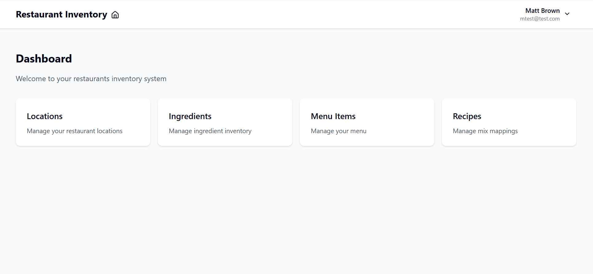
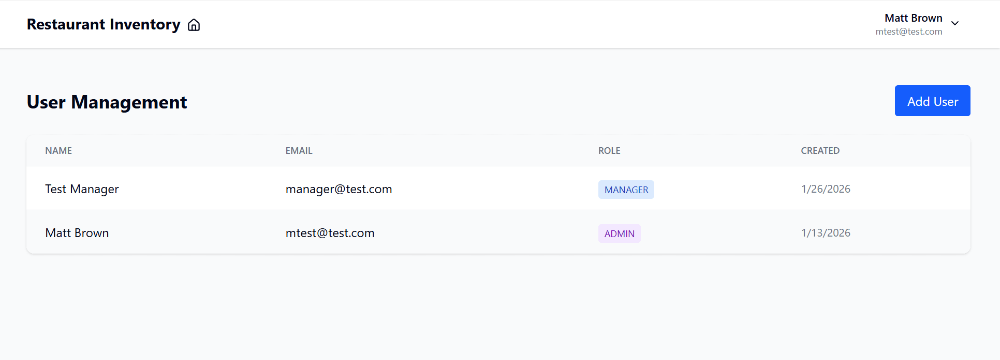
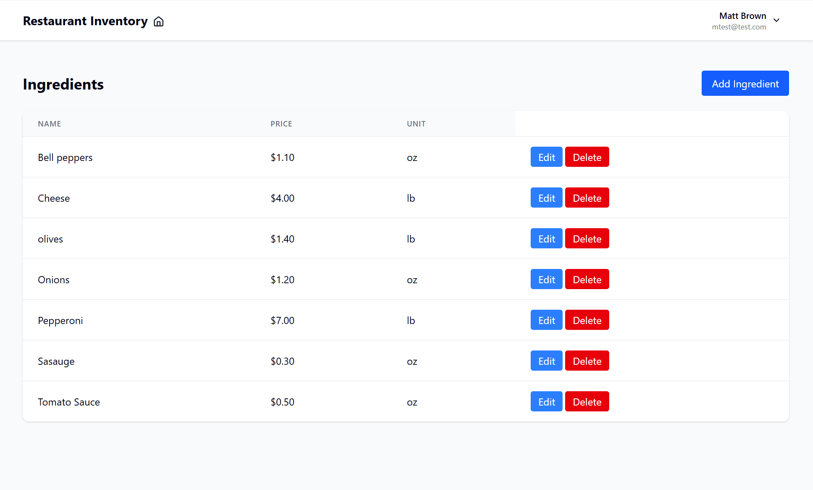
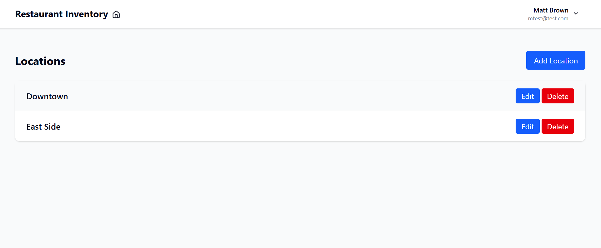
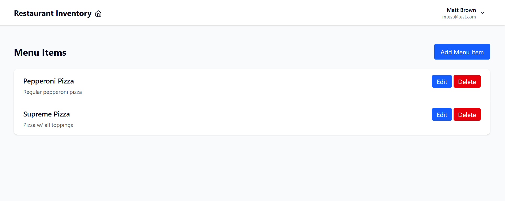
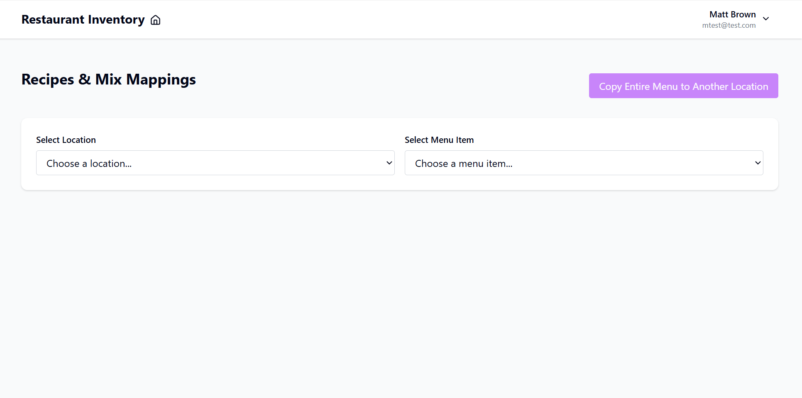
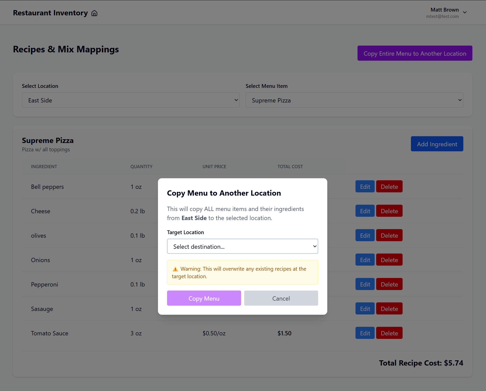

# Restaurant Inventory Management System

A full-stack web application for managing restaurant inventory, recipes, and costs across multiple locations. Built to solve the pain point of manually duplicating recipe data across locations - a limitation found in existing tools like XtraChef.

## 🎯 Key Features

- **Multi-Location Recipe Management** - Create recipes once, copy to multiple locations instantly
- **Cost Tracking** - Automatic cost calculation for recipes based on ingredient prices
- **Role-Based Access Control** - Admin and Manager roles with different permissions
- **Ingredient Master List** - Centralized ingredient database with pricing
- **Menu Item Management** - Organize and track all menu items
- **User Management** - Admins can create and manage team members

## 🚀 The Problem It Solves

Existing restaurant inventory tools like XtraChef require manually entering mix mappings (recipes) one by one for each location. Each location must have every item on their menu manually mapped to the ingredients used in a recipe. This is especially problematic for pizza restaurants because each pizza can contain dozens of different toppings. API access is not given and browser automation within thier platform is fragile. For restaurant groups with multiple locations, this creates hours to weeks or months of repetitive data entry. The purpose of this project is to demonstrate a copy menu feature that would quickly and easily solve this problem within the Xtrachef application.

**Solution:** This app allows you to create recipes at one location and copy the entire menu to other locations with a single click, saving significant time and reducing errors. 


## 🛠️ Tech Stack

### Frontend
- React 18 with TypeScript
- React Router for navigation
- TanStack Query (React Query) for data fetching
- Axios for API requests
- Tailwind CSS for styling

### Backend
- Node.js with Express
- TypeScript
- PostgreSQL database
- Prisma ORM
- JWT authentication
- bcrypt for password hashing

## 📋 Prerequisites

- Node.js (v18 or higher)
- PostgreSQL database (or Supabase account)
- npm or yarn

## 🔧 Installation

1. **Clone the repository**
```bash
git clone https://github.com/mattmach1/restaurant-inventory.git
cd restaurant-inventory
```

2. **Install backend dependencies**
```bash
cd backend
npm install
```

3. **Set up environment variables**

Create `backend/.env`:
```
DATABASE_URL="your-postgresql-connection-string"
JWT_SECRET="your-secret-key-here"
PORT=5000
```

4. **Run database migrations**
```bash
npx prisma migrate dev
```

5. **Install frontend dependencies**
```bash
cd ../frontend
npm install
```

6. **Start the development servers**

Backend:
```bash
cd backend
npm run dev
```

Frontend (in a new terminal):
```bash
cd frontend
npm run dev
```

The app will be available at `http://localhost:5173`

## 👥 User Roles

### Admin
- Full access to all features
- Can create and manage users
- Can delete locations, ingredients, and menu items
- First user who creates an organization is automatically an Admin

### Manager
- Can view all data
- Can create and edit recipes, ingredients, and menu items
- Cannot delete core resources (locations, ingredients, menu items)
- Cannot manage users

## 📱 Usage

1. **Register** - Create an account (first user becomes Admin)
2. **Add Locations** - Set up your restaurant locations
3. **Add Ingredients** - Create your ingredient master list with prices
4. **Create Menu Items** - Add items to your menu
5. **Build Recipes** - Select a location and menu item, then add ingredients with quantities
6. **Copy Menu** - Use the bulk copy feature to duplicate recipes to other locations

## Screenshots

### Dashboard


### User Management


### Ingredients


### Locations


### Menu Items


### Recipe Management



### Bulk Copy Feature


## 🔐 API Endpoints

### Authentication
- `POST /api/auth/register` - Create new organization and admin user
- `POST /api/auth/login` - Login and receive JWT token
- `POST /api/auth/create-user` - Create new user (Admin only)
- `GET /api/auth/users` - Get all users in organization (Admin only)

### Locations
- `GET /api/locations` - Get all locations
- `POST /api/locations` - Create location
- `DELETE /api/locations/:id` - Delete location (Admin only)

### Ingredients
- `GET /api/ingredients` - Get all ingredients
- `POST /api/ingredients` - Create ingredient
- `PATCH /api/ingredients/:id` - Update ingredient
- `DELETE /api/ingredients/:id` - Delete ingredient (Admin only)

### Menu Items
- `GET /api/menu-items` - Get all menu items
- `POST /api/menu-items` - Create menu item
- `PATCH /api/menu-items/:id` - Update menu item
- `DELETE /api/menu-items/:id` - Delete menu item (Admin only)

### Mix Mappings (Recipes)
- `GET /api/mix-mappings` - Get recipe ingredients (query: menuItemId, locationId)
- `POST /api/mix-mappings` - Add ingredient to recipe
- `PATCH /api/mix-mappings/:id` - Update ingredient quantity
- `DELETE /api/mix-mappings/:id` - Remove ingredient from recipe
- `POST /api/mix-mappings/copy` - Copy all recipes from one location to another

## 🏗️ Project Structure
```
restaurant-inventory/
├── backend/
│   ├── src/
│   │   ├── routes/          # API route handlers
│   │   ├── middleware/      # Auth and role checking
│   │   ├── lib/            # Prisma client
│   │   └── index.ts        # Express server setup
│   ├── prisma/
│   │   └── schema.prisma   # Database schema
│   └── package.json
├── frontend/
│   ├── src/
│   │   ├── pages/          # React pages
│   │   ├── components/     # Reusable components
│   │   ├── hooks/          # Custom hooks
│   │   ├── lib/            # API client, utilities
│   │   └── types/          # TypeScript types
│   └── package.json
└── README.md
```

## 🔒 Security Features

- Password hashing with bcrypt
- JWT-based authentication
- Role-based access control
- Protected API routes
- Input validation
- Organization-scoped data (multi-tenancy)

## 🚧 Future Enhancements

- [ ] Export reports to CSV/PDF
- [ ] Upload CSV or JSON file to autofill mix mappings
- [ ] Dashboard analytics with charts
- [ ] Email notifications for low inventory
- [ ] Invoice parsing automation
- [ ] Vendor management

## 📝 License

MIT

## 👤 Author

Matt Brown
- GitHub: https://github.com/mattmach1

## 🙏 Acknowledgments

Built as a portfolio project to demonstrate full-stack development skills.